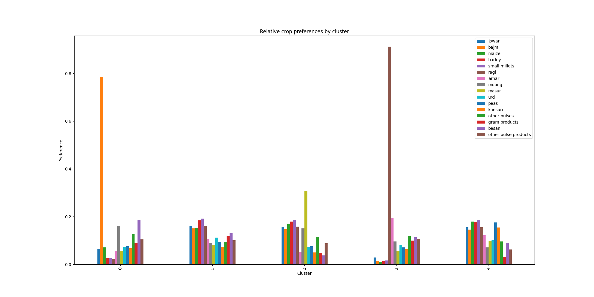
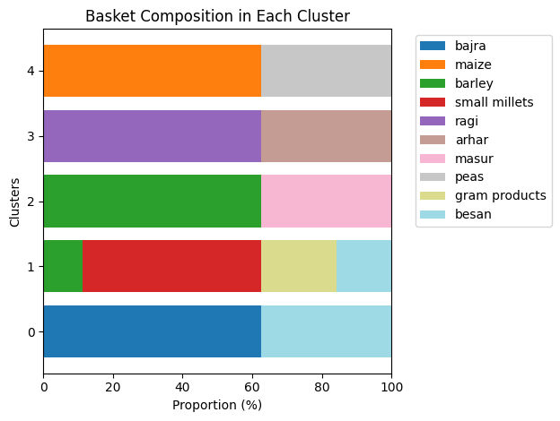
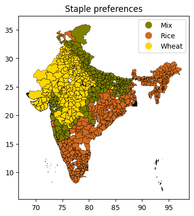
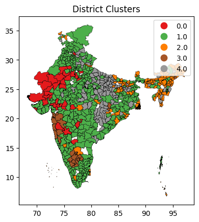
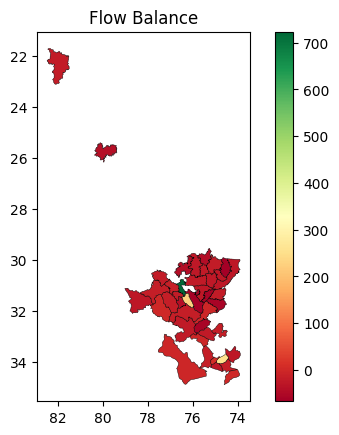
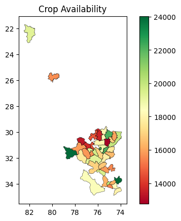

## Figures

### Figure 1: Cluster-wise preferences

### Figure 2. Basket composition (max_pulse=2, max_millet=2)

### Figure 3a: Staple crop preferences map

### Figure 3b. Cluster Assignment

### Figure 3c: Flow balance map
#### Visualizes difference between *all* crop procurement and *all* crop PDS consumption. Can be changed to any individual crop or combination

### Figure 3d. Procurement availability map
#### Currently, shows sum over *all* crops, can be changed to any individual crop or combination

*NOTE* Figures 3c and 3d rely on the ouput of distribution model, which we have only run on select districts so far.
